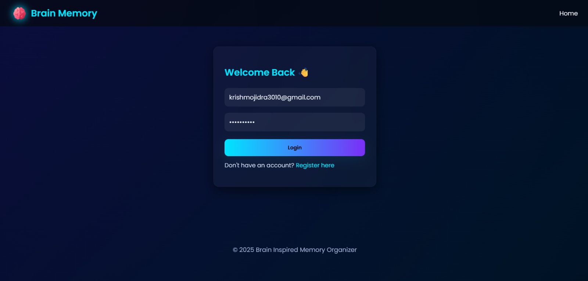
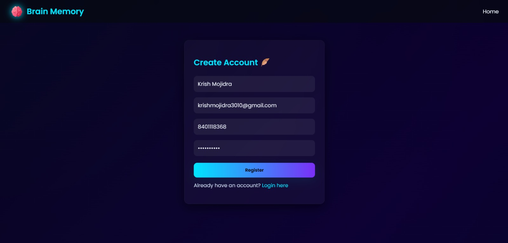
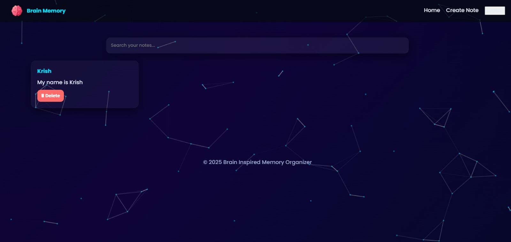
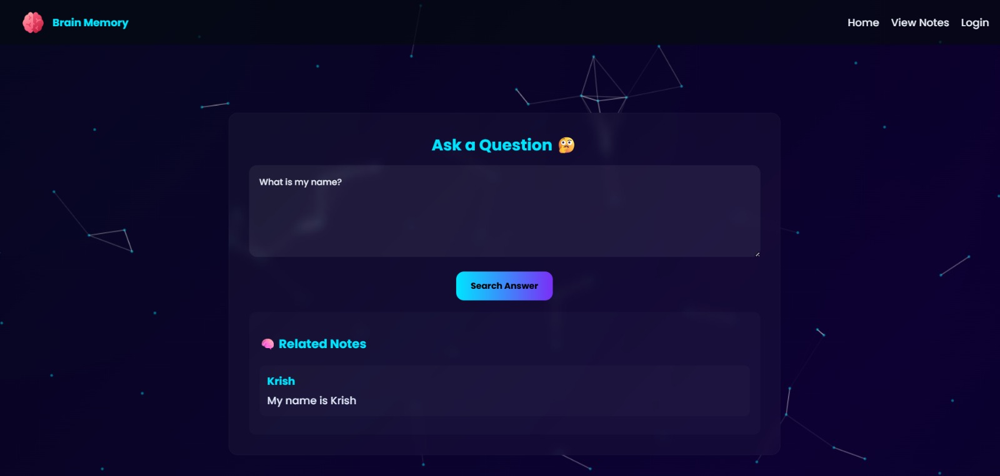

# 🧠 Brain Inspired Memory Organizer

A **brain-inspired note and memory management system** designed to organize, store, and retrieve information efficiently — just like how human memory works.

This project focuses on **fast search, structured storage, and intelligent recall**, making it useful for students, developers, and anyone who wants a smarter way to manage knowledge.

---

## 🚀 Features

- 🧩 Brain-inspired memory organization
- ⚡ Fast note retrieval using efficient data structures
- 🔍 Keyword-based intelligent search
- 🗂️ Organized storage of notes and memories
- 🌐 Simple and clean web-based interface
- 🧠 Inspired by real-world memory recall techniques

---

## 📸 Screenshots

### 🏠 Home Page

### 🔐 Login Page

### 📝 Register Page

### ➕ Create Notes

### 📖 View Notes

### ❓ Question Page

--- 

## 🛠️ Tech Stack

- **Frontend:** HTML, CSS, JavaScript
- **Backend:** Python (Flask)
- **Data Handling:** JSON / File-based storage
- **Core Logic:** Data Structures (Trie, HashMap concepts)

---

## ▶️ How to Run the Project

Follow the steps and paste the given commonds in the commond prompt to run this project locally:

### 1️⃣ Clone the Repository

`git clone https://github.com/Krish-3010/Brain-Inspired-Memory-Oraganizer`

### 2️⃣ Navigate to Project Directory

`cd Brain-Inspired-Memory-Oraganizer`

### 3️⃣ Create Virtual Environment (Optional but Recommended)

`python -m venv venv`

### 4️⃣ Activate Virtual Environment

- **Windows:**

`venv\Scripts\activate`

- **Mac/Linux:**

`source venv/bin/activate`

### 5️⃣ Install Required Dependencies

`pip install -r requirements.txt`

### 6️⃣ Run the Flask Application

`python app.py`

### 7️⃣ Open in Browser

http://127.0.0.1:5000/

---

### 🔐 Security Considerations

- Sensitive files (such as cache files and local JSON data) should not be committed to GitHub
- `.gitignore` is used to prevent accidental exposure of:
  - `_pycache_`
  - `.env`
  - Local JSON or temporary files

---

### 🤝 Open for Collaboration

This project is open for collaboration 🚀

Contributions are welcome in the form of:
- Feature enhancements
- Bug fixes
- UI/UX improvements
- Performance optimizations
- Documentation improvements

How to Contribute
- Fork the repository
- Create a new branch
- Make your changes
- Submit a Pull Request

---

### 👤 Author

- **Krish Mojidra**

  🎓 Student At Nirma University | 💻 Aspiring Software Engineer

---

### ⭐ Support

If you find this project helpful Give it a ⭐ on GitHub and Share feedback or suggestions.
